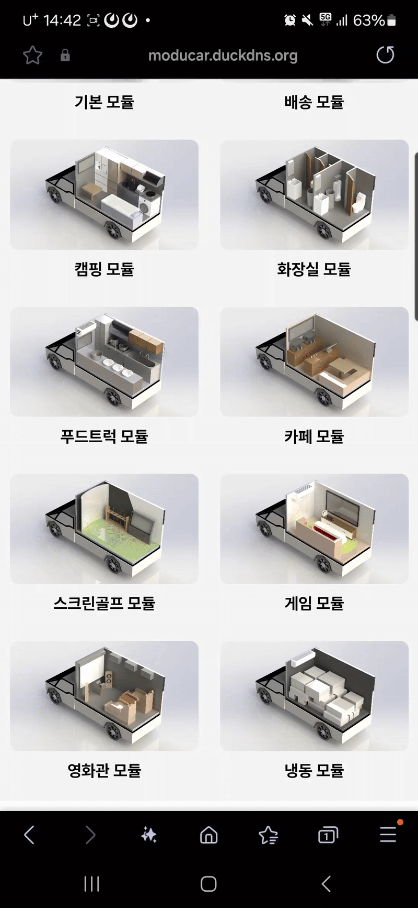
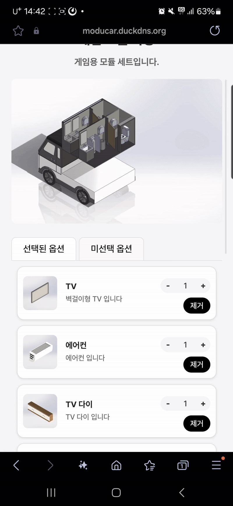
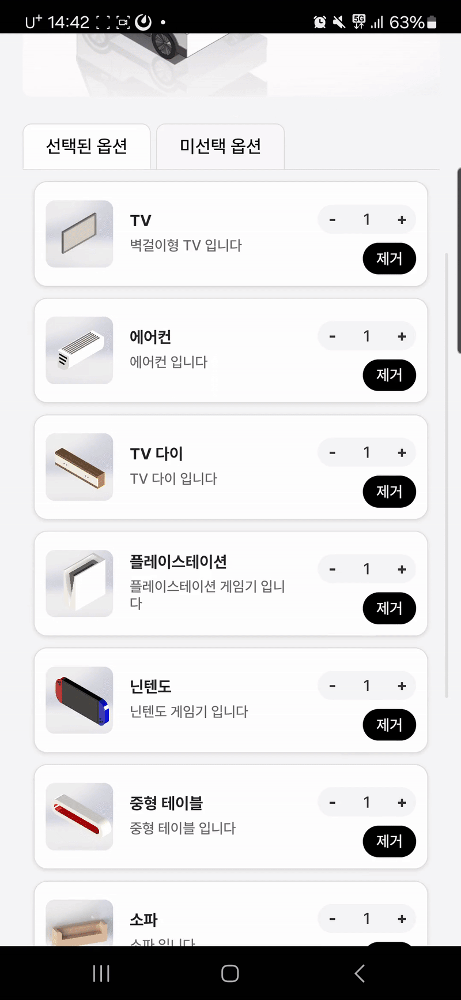
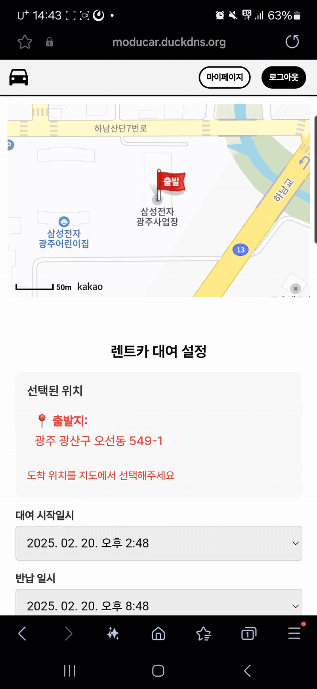
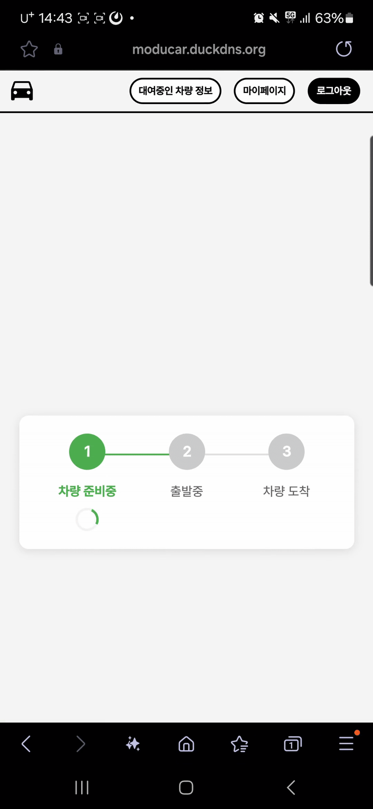

# **ModuCar**

<div align="center">

</div>

<br>

## **목차**

* [소개](#소개)
* [팀원](#팀원)
* [개발 환경](#개발-환경)
* [기능 설명](#기능-설명)
* [개발 내용](#개발-내용)
  
<br>

## **소개**

- 기획의도
- 서비스설명

<br>

## **팀원**

<div align="center">
    <table>
        <tr align="center">
            <th>신용현</th>
            <th>고형주</th>
            <th>정명진</th>
            <th>송명석</th>
            <th>이범진</th>
            <th>박수연</th>
        </tr>
        <tr align="center">
            <td>
                <br/>
                <a href="https://github.com/sms1875">@sms1875</a>
            </td>
            <td>
                <br/>
                <a href="https://github.com/sms1875">@sms1875</a>
            </td>
            <td>
                <br/>
                <a href="https://github.com/sms1875">@sms1875</a>
            </td>
            <td>
                <br/>
                <a href="https://github.com/sms1875">@sms1875</a>
            </td>
            <td>
                <br/>
                <a href="https://github.com/sms1875">@sms1875</a>
            </td>
            <td>
                <br/>
                <a href="https://github.com/sms1875">@sms1875</a>
            </td>
        </tr>
        <tr align="center">
            <td>1</td>
            <td>2</td>
            <td>3</td>
            <td>4</td>
            <td>5</td>
            <td>6</td>
        </tr>
    </table>
</div>

<br>

## **개발 환경**

**FrontEnd**
- React 18.3.1

**BackEnd**
- Python 3.9
- FastAPI 0.115.7
- SQLite
- Upstash Redis
- AWS S3

**Embedded**
- Python 3.9
- OpenCV

**Etc**
- Fly.io
- AWS EC2

**시스템 아키텍처**


<br>

## **기능 설명**

### **1. 사용자 페이지**

| 로그인/회원가입 |
|----------|
|   |


| 모듈 조회/선택 |
|----------|
|   |

| 옵션 검색/추가/삭제 |
|----------|
|   |

| 렌트 |
|----------|
|   |

| 마이페이지 |
|----------|
| |


## **개발 내용**

```
├─assets
├─backend
│  ├─.devcontainer
│  ├─.pytest_cache
│  ├─.vscode
│  ├─app
│  │  ├─api
│  │  │  ├─routes
│  │  │  │  ├─admin
│  │  │  │  └─user
│  │  │  └─schemas
│  │  │      ├─admin
│  │  │      └─user
│  │  ├─core
│  │  ├─db
│  │  │  ├─crud
│  │  │  └─models
│  │  ├─services
│  │  │  ├─admin
│  │  │  └─user
│  │  ├─utils
│  │  └─websocket
│  └─tests
│      ├─admin
│      ├─auth
│      └─user
├─frontend
│  ├─public
│  └─src
│      ├─admin
│      │  ├─components
│      │  └─context
│      ├─assets
│      │  └─font
│      ├─common
│      ├─finishSelect
│      ├─main
│      ├─moduleSelect
│      ├─optionSelect
│      ├─rentForm
│      ├─RentStatus
│      ├─signup
│      ├─user
│      └─utils
└─modeling
```

### **Modeling**


### **FrontEnd**

#### **1. 기술 스택**

**Core**
- React 18.3.1
- Vite.js
- JavaScript/JSX

**상태 관리 & 인증**
```javascript
// 토큰 기반 인증 관리
const AdminAuthContext = createContext({
  isAuthenticated: false,
  token: null,
  login: () => {},
  logout: () => {},
});
```

**UI/컴포넌트**
- Recharts (대시보드 차트)
- React Icons
- 커스텀 컴포넌트
  - Modal System
  - LoadingSpinner
  - DashboardCards

**스타일링**
```css
/* 반응형 디자인 */
@media (max-width: 768px) {
  .container {
    flex-direction: column;
    padding: 10px;
  }
}
```

#### **2. 주요 기능**

**대시보드 시스템**
```javascript
// 실시간 데이터 시각화
const DashboardChart = ({ data }) => {
  return (
    <BarChart width={600} height={300} data={data}>
      <XAxis dataKey="name" />
      <YAxis />
      <Tooltip />
      <Bar dataKey="value" fill="#8884d8" />
    </BarChart>
  );
};
```

**차량 관리 시스템**
- 모듈 CRUD 작업
- 옵션 관리
- 실시간 상태 추적

**지도 서비스 연동**
```javascript
// Kakao Maps 통합
const MapContainer = () => {
  useEffect(() => {
    const container = document.getElementById('map');
    const options = {
      center: new kakao.maps.LatLng(33.450701, 126.570667),
      level: 3
    };
    const map = new kakao.maps.Map(container, options);
  }, []);
};
```

#### **3. 성능 최적화**

**코드 스플리팅**
```javascript
// 지연 로딩 구현
const DashboardPage = lazy(() => import('./pages/Dashboard'));
const OptionsPage = lazy(() => import('./pages/Options'));
```

**캐싱 전략**
```javascript
// API 응답 캐싱
const useCachedData = (key) => {
  const [data, setData] = useState(null);
  
  useEffect(() => {
    const cached = localStorage.getItem(key);
    if (cached) {
      setData(JSON.parse(cached));
    }
  }, [key]);
};
```

#### **4. 보안**

**토큰 관리**
```javascript
// JWT 인터셉터 설정
axios.interceptors.request.use(
  (config) => {
    const token = localStorage.getItem('token');
    if (token) {
      config.headers.Authorization = `Bearer ${token}`;
    }
    return config;
  },
  (error) => {
    return Promise.reject(error);
  }
);
```

**접근 제어**
```javascript
// 보호된 라우트 구현
const ProtectedRoute = ({ children }) => {
  const { isAuthenticated } = useAuth();
  return isAuthenticated ? children : <Navigate to="/login" />;
};
```

#### **5. 프로젝트 구조**

```
frontend/
├── src/
│   ├── admin/
│   │   ├── components/
│   │   └── context/
│   ├── assets/
│   ├── common/
│   ├── moduleSelect/
│   ├── optionSelect/
│   ├── rentForm/
│   └── utils/
```

### **BackEnd**


### **Embedded**

### **Security**
**1. JWT Token**

JWT Token을 이용하여 사용자 인증 구현 및 Redis에 Refresh Token을 저장하여 리소스를 관리하였습니다.

```
def _create_access_token(self, user_pk: int, encrypted_role: str) -> str:
        try:
            expires_at = datetime.now() + timedelta(seconds=self.settings.ACCESS_TOKEN_EXPIRE_SECONDS)
            payload = JWTPayload(
                exp=expires_at,
                user_pk=user_pk,
                role=encrypted_role,
                type="access"
            ).to_dict()
            return jwt.encode(
                payload,
                self.settings.JWT_SECRET_KEY,
                algorithm=self.settings.JWT_ALGORITHM
            )
        except Exception as e:
            raise JWTError(
                message="Failed to create access token",
                detail={"error": str(e)}
            )
```

**2. bcrypt**

bcrypt hash를 이용하여 비밀번호 저장 및 검증을 구현하였습니다.

```
import bcrypt

def hash_password(password: str) -> str:
    """
    주어진 비밀번호를 `bcrypt`로 해싱하는 함수

    Args:
        password (str): 원본 비밀번호

    Returns:
        str: 해싱된 비밀번호
    """
    return bcrypt.hashpw(password.encode("utf-8"), bcrypt.gensalt()).decode("utf-8")

def verify_password(plain_password: str, hashed_password: str) -> bool:
    """
    입력된 비밀번호가 저장된 해시와 일치하는지 검증하는 함수

    Args:
        plain_password (str): 입력된 원본 비밀번호
        hashed_password (str): 데이터베이스에 저장된 해싱된 비밀번호

    Returns:
        bool: 비밀번호 일치 여부
    """
    return bcrypt.checkpw(plain_password.encode("utf-8"), hashed_password.encode("utf-8"))
```

**3. 역할 기반 접근 제어(Role Based Access Control, RBAC)**

JWT Token을 이용하여 Role을 관리하고, 관리자 페이지에서 Role에 따라 기능 제한 로직을 구현하였습니다.

```
async def get_module_set_list(
    page: int = Query(1, gt=0, description="현재 페이지 (최소 1)"),
    pageSize: int = Query(10, gt=0, description="페이지 당 모듈 세트 개수 (최소 1)"),
    session: Session = Depends(get_session),
    token_data: JWTPayload = Depends(jwt_handler.jwt_auth_dependency(allowed_roles=["semi", "master"]))
):
    return ModuleSetService.get_module_set_list(session, page, pageSize)

async def create_module_set(
    register_request: ModuleSetRegisterRequest,
    session: Session = Depends(get_session),
    token_data: JWTPayload = Depends(jwt_handler.jwt_auth_dependency(allowed_roles=["master"]))
) -> ModuleSetMessageResponse:
    return ModuleSetService.register_module_set(session, register_request, token_data.user_pk)

```

### **배포**

